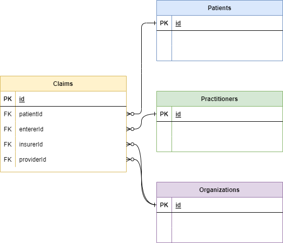

# Demo set for Liquid Notebooks

This is a demo set of data that can be used to learn the Liquid language with the VSCode Extension for Liquid Notebooks. The set is created as a collection of Comma Separated Value files. Every record is separated by a new line, where the first line defines the field names. Every field/column is separated by a comma. The starting point of this data set is Claims. This is the data model:

